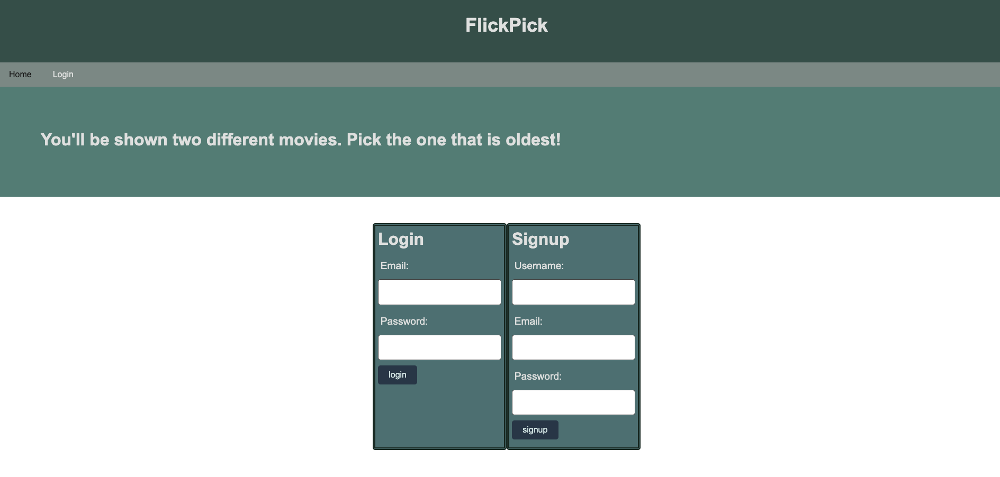
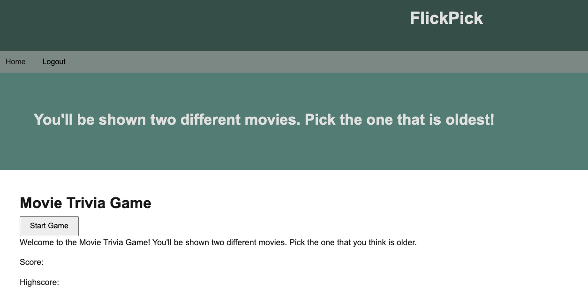
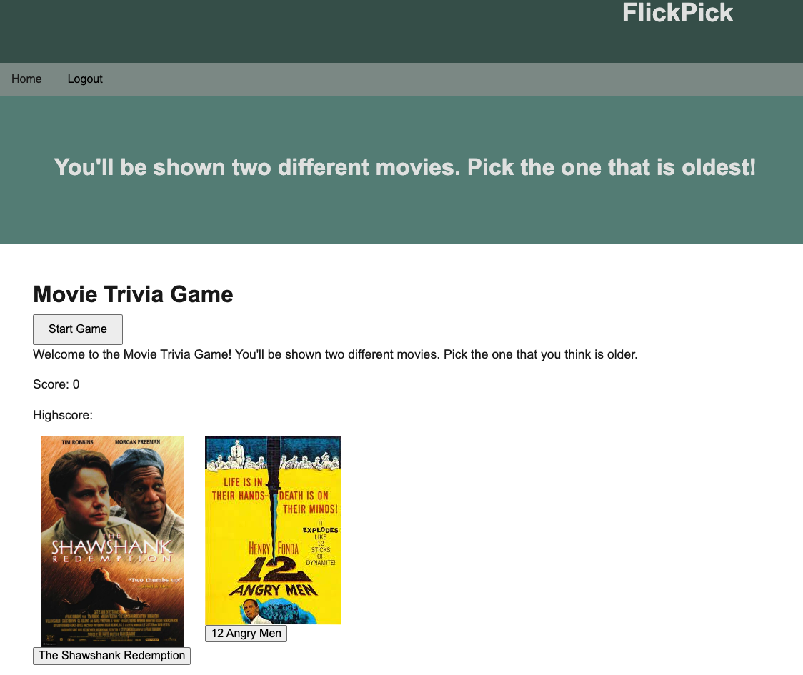
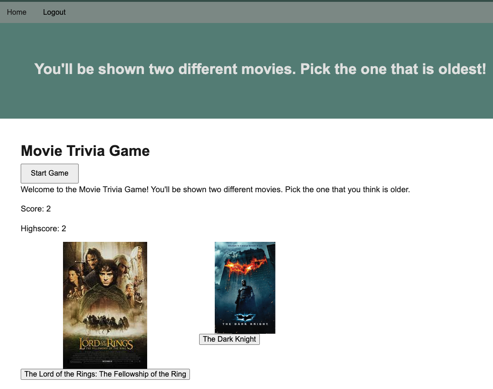
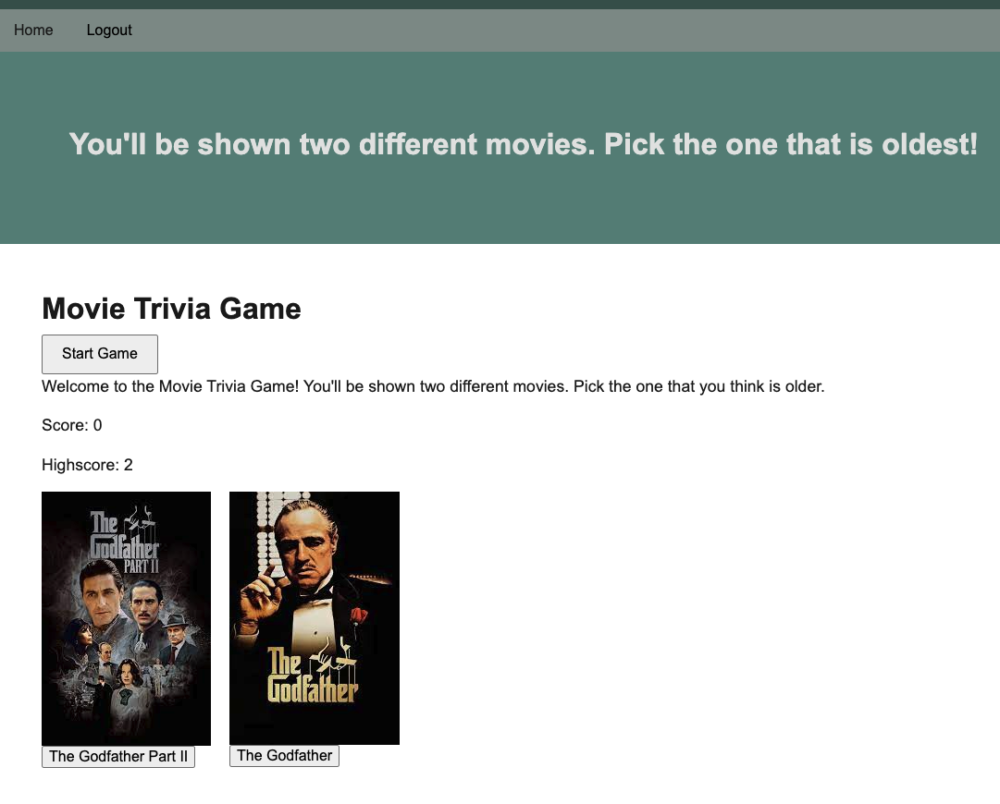

# FLICK PICK

# Description

FLICK PICK is an engaging and entertaining game designed to challenge players' knowledge of movies across various genres and eras. Whether you're a casual movie watcher or a hardcore cinephile, this game offers an opportunity to test your film knowledge in a fun and interactive way.

# Installation

You don't need to install anything. You can open this in any browser on your computer.

# Usage

Navigate to the link on your browser, and create an account. Once you have an account you can start playing. 

The following images depict the appearance and functionality of the [web application](https://flickpickproject-67fa6c76aec5.herokuapp.com/) .

# Link to deployed application

FLICK PICK: https://flickpickproject-67fa6c76aec5.herokuapp.com/

# Credit

[Cooper](https://github.com/coopergriffin) \
[Ryan](https://github.com/Ryanwalker2) \
[Siva](https://github.com/sivanishanthar) 

# License

MIT License

Copyright (c) 2023 

Permission is hereby granted, free of charge, to any person obtaining a copy
of this software and associated documentation files (the "Software"), to deal
in the Software without restriction, including without limitation the rights
to use, copy, modify, merge, publish, distribute, sublicense, and/or sell
copies of the Software, and to permit persons to whom the Software is
furnished to do so, subject to the following conditions:

The above copyright notice and this permission notice shall be included in all
copies or substantial portions of the Software.

THE SOFTWARE IS PROVIDED "AS IS", WITHOUT WARRANTY OF ANY KIND, EXPRESS OR
IMPLIED, INCLUDING BUT NOT LIMITED TO THE WARRANTIES OF MERCHANTABILITY,
FITNESS FOR A PARTICULAR PURPOSE AND NONINFRINGEMENT. IN NO EVENT SHALL THE
AUTHORS OR COPYRIGHT HOLDERS BE LIABLE FOR ANY CLAIM, DAMAGES OR OTHER
LIABILITY, WHETHER IN AN ACTION OF CONTRACT, TORT OR OTHERWISE, ARISING FROM,
OUT OF OR IN CONNECTION WITH THE SOFTWARE OR THE USE OR OTHER DEALINGS IN THE
SOFTWARE.

